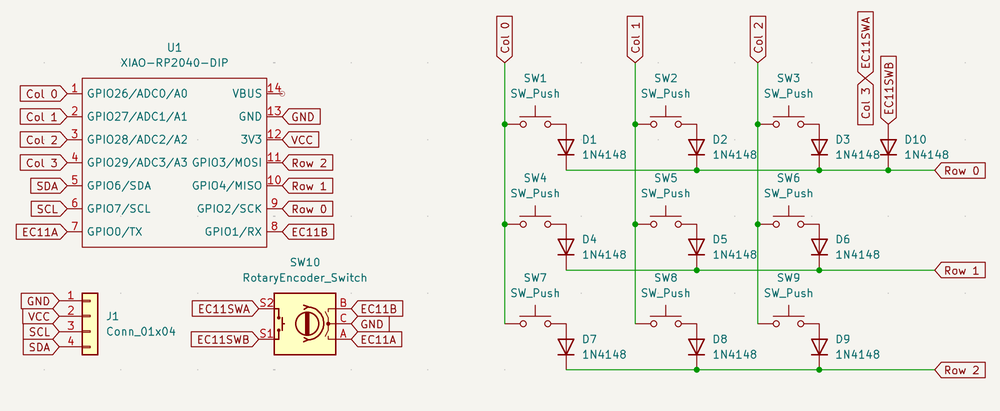

# Monkeypad
Monkeypad is a macropad with 9 switches, an OLED screen and a rotary encoder.

*Completely designed by [@somewhat9](github.com/somewhat9).*

## Features:
- 128x32 OLED Display
- EC11 Rotary Encoder
- 9 Keys
- 3D Printed Case
- QMK Firmware

### Schematic
Used [KiCAD](https://www.kicad.org/), an open source EDA software, to create the schematic and design the PCB. 

### PCB

### Case
Utilized [Onshape](https://www.onshape.com/en/), a 3D modeling CAD software, to design the 3D models for the case. 

### Firmware
The firmware for this macropad was built using the [QMK](https://qmk.fm/) project.
The open-source repository can be found [here](https://github.com/qmk/qmk_firmware).

## BOM:
- 9x Cherry MX Switches
- 1x EC11 Rotary Encoder
- 1x 128x32 OLED Display
- 1x XIAO RP2040
- 9x Blank DSA Keycaps (White)
- 4x M3x16mm Screws
- 4x M3x5mx4mm Heatset Inserts
- 1x 3D Printed Case

